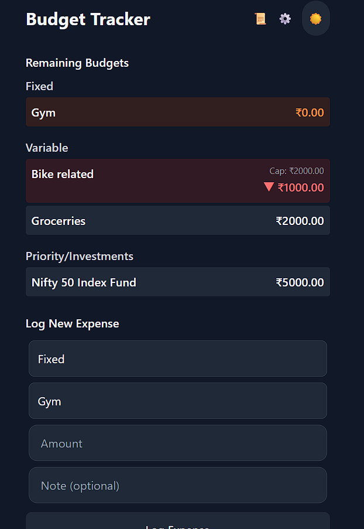
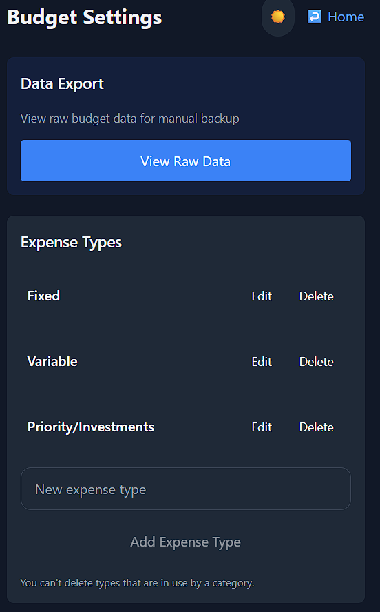
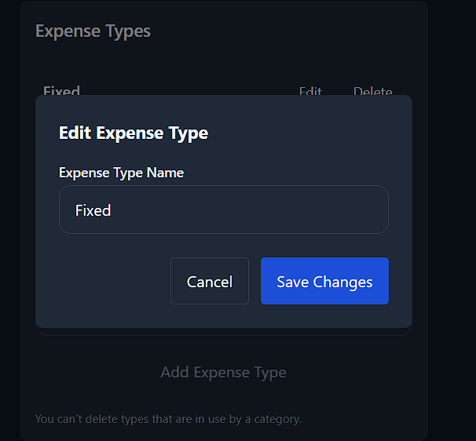
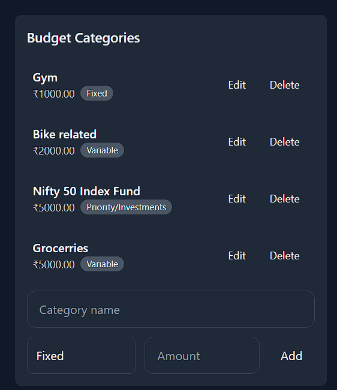
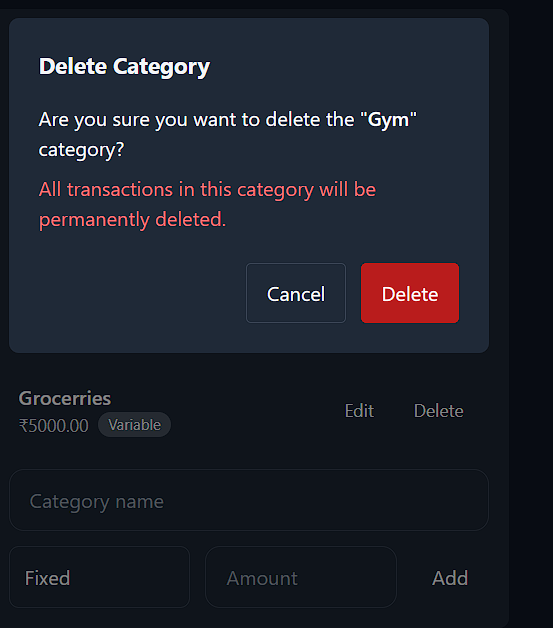
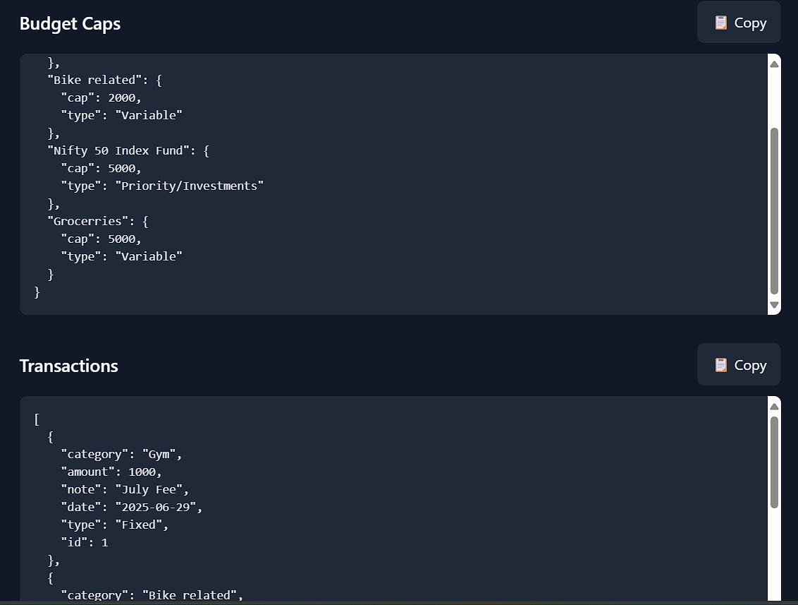

# Budget Tracker PWA

A progressive web application for tracking budgets and expenses with offline capabilities, built with React, TypeScript, and IndexedDB.

## Why This Exists

This application solves personal envelope budgeting challenges by:
- Setting fund envelopes for different needs
- Tracking expenses within each envelope
- Exporting raw data at month-end for analysis

## The Process

1. **Information** - Capture all spending data
2. **Reformation** - Organize and categorize expenses
3. **Transformation** - Gain insights to improve financial habits

## Key Features

✓ Simple envelope management  
✓ Cross-platform accessibility  
✓ Offline functionality  
✓ Data export capabilities  

As a PWA, it delivers a native app experience across all devices while maintaining data in browser cache.



## Features

- 📊 Create and manage budget categories with caps
- 💸 Log expenses with notes and dates
- 🌓 Dark/Light mode toggle
- 📲 Full PWA support (installable, offline access)
- 📥 Export/import raw data
- 🔒 Data persistence using IndexedDB
- 📱 Responsive design for all devices

## Live Demo

Access the live version at:  
[https://indrajithvinodnair.github.io/budTars/](https://indrajithvinodnair.github.io/budTars/)

## Technologies Used

- **Frontend**: React 19, TypeScript
- **Styling**: Tailwind CSS
- **Build Tool**: Vite
- **State Management**: React Hooks
- **Database**: IndexedDB
- **Routing**: React Router
- **PWA**: Vite PWA Plugin
- **Deployment**: GitHub Pages

## Getting Started

### Prerequisites

- Node.js (v18+)
- npm (v9+)

### Local Development

1. Clone the repository:
```bash
git clone https://github.com/indrajithvinodnair/budTars.git
cd budTars
```

2. Install dependencies:
```bash
npm install
```

3. Start the development server:
```bash
npm run dev
```

4. Open in your browser:
```
http://localhost:5173
```

### Building for Production

```bash
npm run build
```

### Deploying to GitHub Pages

```bash
npm run deploy
```

## Application Structure

```
src/
├── components/         # Reusable components
├── contexts/           # React context providers
├── hooks/              # Custom React hooks
├── pages/              # Application pages
│   ├── App.tsx         # Main application
│   ├── Settings.tsx    # Settings page
│   └── RawData.tsx     # Data export page
├── index.css           # Global styles
└── main.tsx            # Entry point
```

## PWA Features

- Offline access with service workers
- Installable on mobile devices
- Automatic updates
- Manifest with app icons
- Background sync support

## Contributing

Contributions are welcome! Please follow these steps:

1. Fork the repository
2. Create a new branch (`git checkout -b feature/your-feature`)
3. Commit your changes (`git commit -am 'Add some feature'`)
4. Push to the branch (`git push origin feature/your-feature`)
5. Create a new Pull Request

## License

This project is licensed under the MIT License - see the [LICENSE](LICENSE) file for details.

## Screenshots

| Home Page | Settings
|-------------------|-------
|  |  

| Expense Types Add | Edit
|-------------------|-------
 |  | 

 | Budget Categories Add | Edit
|------------------------|-------
 |  | 

 | Settings Raw Data Export
|------------------
 | 

## Troubleshooting

If you encounter issues:
- Clear browser cache and service workers
- Ensure you're using the latest version of Node.js
- Check console for error messages
- Verify IndexedDB storage in developer tools

---
